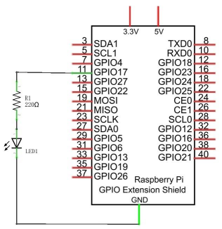

# RaspberryFlasher_CSharp
Example of a C# Raspberry Pi GPIO configuration running on Dotnet 3.1.

The progame makes use of Visual Studio Codes `tasks` and `launch` configurations to run the code in remote debug mode.  I.e. you can debug the code running on the Pi from your local development PC.


## .vscode/task.json
There are 3 tasks
* build
* publish
* deploy

The deploy task is the more interesting.  It takes the `publish` task output and deploys it on the Pi. Rsync is used to deploy only those files which change. This is more efficient than using SCP to copy the entire contents of the Publish task output.

Note: SSH keys are used for authentication. This requires that the host public key has been added to the Pi's `~/.ssh/authorized_keys` file.

## .vscode/launch.json
Configures remote debug mode and triggers the `deploy` task (and its `publish` and `build` dependencies) and _launches_ the progame in remote debug mode.

## The code
Super simple loop setting an LED output to HIGH then LOW in a loop.




### SSH requirements
The Pi must be running an SSH server (i.e. openSSh). This is not installed on Rasberrian Lite for example.
```
sudo apt update
sudo apt install openssh-server
```
Check that it's running: `sudo systemctl status ssh`

You will also need to add the hosts public SSH key (e.g. _id_rsa.pub_) to the Pi's authorized keys.
```
cd ~/.ssh
cat id_rsa.pub | ssh pi@192.168.0.18 'cat >> .ssh/authorized_keys'
```
